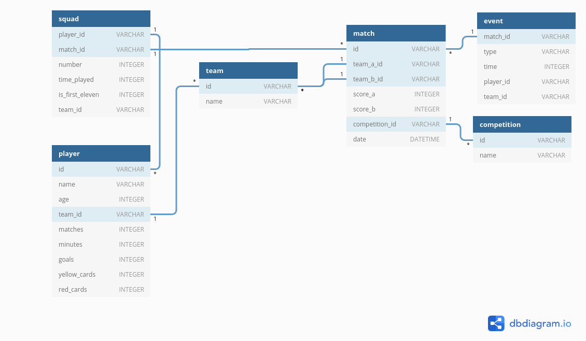

# Okregowa Stats

Gathering data from various polish football competitions. Storing data in sqlite.

## Functionality

1. Scraping [https://www.laczynaspilka.pl/](https://www.laczynaspilka.pl/) website for given matches list:

    ```
    updater = Updater("newstal.db", "https://www.laczynaspilka.pl/druzyna-sezon/stal-szczecin/208849.html", "https://www.laczynaspilka.pl/druzyna/stal-szczecin,208849.html")
    updater.update()
    ```
    
    Where second argument is only required for scrapping. Third one is for getting data from Updater for given team.
    It should have been separated.
    
2. Storing serialized data in sqlite database using SQLAlchemy ORM.
3. Getting stats from database.

    ```
    updater.print_scored_goals()
    updater.print_conceded_goals()
    updater.print_squad()
    updater.print_form()
    updater.print_average_points_per_match("https://www.laczynaspilka.pl/rozgrywki/nizsze-ligi,20725.html")
    updater.print_win_percentage("https://www.laczynaspilka.pl/rozgrywki/nizsze-ligi,20725.html")
    updater.print_draw_percentage("https://www.laczynaspilka.pl/rozgrywki/nizsze-ligi,20725.html")
    updater.print_lose_percentage("https://www.laczynaspilka.pl/rozgrywki/nizsze-ligi,20725.html")
    updater.print_last_matches("https://www.laczynaspilka.pl/rozgrywki/nizsze-ligi,20725.html")
    updater.print_last_away_matches("https://www.laczynaspilka.pl/rozgrywki/nizsze-ligi,20725.html")
    updater.print_last_home_matches("https://www.laczynaspilka.pl/rozgrywki/nizsze-ligi,20725.html")
    ```

## Example output

    ```
    Strzelone gole:  50
    0-15:  4 8.0%
    16-30:  10 20.0%
    31-45:  10 20.0%
    46-60:  7 14.000000000000002%
    61-75:  8 16.0%
    76-90:  8 16.0%
    
    Stracone gole:  58
    0-15:  3 5.172413793103448%
    16-30:  7 12.068965517241379%
    31-45:  10 17.24137931034483%
    46-60:  10 17.24137931034483%
    61-75:  13 22.413793103448278%
    76-90:  13 22.413793103448278%
    
    
    ('Mateusz Jarząbek', 2233, [(22, 24), (30, 1)], 22, 0, 1, 0)
    ('Adam Bogacz', 2160, [(6, 23), (15, 1)], 6, 2, 8, 0)
    ('Dominik Ceglarek', 2140, [(2, 25)], 2, 6, 4, 1)
    ('Tomasz Cydzik', 1890, [(3, 2), (4, 15), (7, 1), (17, 1), (21, 1), (22, 1)], 4, 4, 2, 0)
    ('Wojciech Dochniak', 1961, [(7, 1), (10, 24)], 10, 5, 1, 0)
    ('Kamil Dzięgielewski', 110, [(7, 2), (11, 1)], 7, 0, 0, 0)
    ('Patryk Kowalski', 1040, [(9, 12), (10, 3)], 10, 2, 4, 0)
    ('Bartłomiej Malczewski', 2170, [(15, 1), (17, 13), (18, 1), (19, 9), (21, 1)], 19, 3, 7, 1)
    ('Kajetan Wis', 1873, [(3, 3), (4, 1), (5, 16), (6, 3), (15, 1)], 3, 1, 4, 0)
    ('Tomasz Woźniak', 1067, [(17, 11), (18, 2), (19, 7), (20, 2), (21, 3)], 17, 0, 0, 0)
    ('Michał Żurawik', 999, [(3, 11), (11, 1), (15, 1), (16, 1)], 3, 0, 4, 1)
    ('Maciej Dochniak', 1708, [(2, 3), (4, 1), (7, 7), (8, 4), (9, 1), (10, 3), (11, 3)], 7, 0, 1, 0)
    ('Norbert Grązka', 432, [(15, 1), (16, 7), (21, 1)], 16, 0, 5, 1)
    ('Tomasz Jęśko', 184, [(2, 1), (4, 2), (5, 1), (14, 1), (15, 1)], 5, 0, 0, 0)
    ('Kacper Sikorski', 398, [(1, 14), (12, 1), (22, 2)], 1, 0, 0, 0)
    ('Mikołaj Waszak', 1029, [(8, 22), (13, 1), (30, 2)], 8, 0, 2, 0)
    ('Marcel Wójtowicz', 44, [(8, 1)], 8, 0, 0, 0)
    ('Konrad Pyś', 1988, [(14, 23), (16, 2), (17, 1), (19, 1)], 14, 8, 4, 2)
    ('Andrzej Wilczyński', 389, [(5, 1), (7, 1), (8, 2), (16, 1), (19, 1), (21, 4)], 21, 0, 2, 0)
    ('Michał Jęśko', 161, [(7, 2), (16, 1), (17, 1), (19, 1), (21, 1)], 7, 0, 0, 0)
    ('Sebastian Kujawski', 38, [(3, 9), (11, 2), (14, 1), (15, 1), (21, 1)], 3, 0, 3, 0)
    ('Krystian Mazurek', 115, [(14, 5)], 14, 0, 0, 0)
    ('Wojciech Pawłowski', 79, [(6, 2), (8, 1), (9, 1), (10, 1), (15, 8)], 15, 0, 0, 0)
    ('Jakub Staciwa', 789, [(3, 1), (5, 12), (11, 1), (15, 1), (19, 1), (20, 1), (21, 1)], 5, 0, 2, 1)
    ('Mateusz Wiśniewski', 1506, [(11, 18)], 11, 6, 4, 1)
    ('Mariusz Sypuła', 1898, [(18, 25)], 18, 8, 2, 0)
    ('Przemysław Klowan', 20, [(7, 1), (16, 1), (21, 2)], 21, 0, 0, 0)
    ('Gracjan Sylwestrzak', 0, [(11, 1)], 11, 0, 0, 0)
    ('Marcin Storek', 567, [(7, 11)], 7, 2, 0, 0)
    ('Piotr Witczak', 1031, [(9, 14), (19, 1), (20, 1)], 9, 3, 1, 0)
    ('Eryk Krasiński', 20, [(15, 2)], 15, 0, 0, 0)
    ('Jan Mołda', 195, [(4, 2), (16, 7), (19, 1)], 16, 0, 1, 0)
    ('Filip Stanowski', 0, [(1, 2)], 1, 0, 0, 0)
    ('Oskar Kronkowski', 301, [(4, 7), (19, 1)], 4, 0, 0, 0)
    ('Miłosz Waszak', 70, [(16, 7), (19, 1), (20, 2), (21, 4)], 19, 0, 0, 0)
    ('Damian Tusiński', 21, [(6, 1), (11, 2), (21, 3)], 11, 0, 0, 0)
    ('Oskar Sosnowski', 69, [(1, 2), (12, 2), (22, 1)], 12, 0, 0, 0)
    [('L', 'STAL SZCZECIN', 'CHEMIK POLICE', 0, 7, datetime.datetime(2018, 6, 16, 12, 0)), ('L', 'PIAST CHOCIWEL', 'STAL SZCZECIN', 2, 1, datetime.datetime(2018, 6, 9, 16, 0)), ('W', 'STAL SZCZECIN', 'BŁĘKIT PNIEWO', 2, 0, datetime.datetime(2018, 6, 2, 11, 0)), ('L', 'ISKRA GOLCZEWO', 'STAL SZCZECIN', 1, 0, datetime.datetime(2018, 5, 26, 16, 0)), ('L', 'STAL SZCZECIN', 'BIALI SĄDÓW', 0, 1, datetime.datetime(2018, 5, 19, 11, 0))]
    ```
## Database

Schema:



I've used sqlite as it was fast for prototyping.

## Usage

You should use [venv](https://docs.python.org/3/library/venv.html) for creating virtual environment.

``virtualenv .venv``

Then active this virtual environment with:

``source .venv/bin/activate``

And install all requirements with:

```pip install -r requirements.txt```
